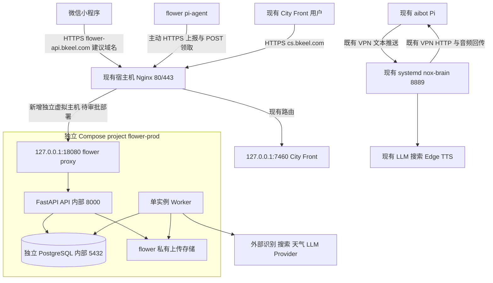

# 建议部署拓扑与演进路线

状态：2026-09-13 架构建议，未实施。现状依据 [CURRENT_SERVER_INVENTORY.md](CURRENT_SERVER_INVENTORY.md)。推荐 B：同机、业务独立，按实际需求逐步抽取共享 AI 能力。

## 1. 近期目标拓扑



图中的 flower 服务、域名和端口都是建议，不代表已部署或 DNS 已配置。现有 Nginx 目前只代理 City Front；aibot 8889 直接绑定主机 IPv4，走现有 VPN 通路，并非已经由 Nginx 代理。

保持 flower 的 `proxy/api/worker/postgres` 四服务结构。其 `proxy` 使用轻量 Nginx，仅接收宿主机环回转发的 HTTP，不申请证书、不占用宿主机 80/443。API 和 Worker 使用同一固定镜像、同一 Schema 和决策模块，以不同命令启动。

这样保留当前四服务验收要求，也可在独立开发机/离线笔记本运行整套 Compose。宿主机 Nginx 与内部 proxy 多一跳的资源代价很小；未来若决定删掉内部 proxy、改为三服务，需另行修改“四服务固定”的文档和验收，不作为此次默认方案。

## 2. Docker 隔离边界

| 维度 | 近期规则 |
|---|---|
| 项目生命周期 | flower 使用 `flower-prod`；未来 aibot 容器化才使用 `aibot-prod`。本次不迁移 aibot 的 systemd |
| 网络 | flower 自有 `app` 网络承载 proxy/API/Worker 与外部 Provider 出站；`db` 网络设 internal，仅 API/Worker/PostgreSQL 加入 |
| 数据库可达性 | PostgreSQL 仅在 db 网络，未发布宿主机端口；proxy 不加入 db 网络 |
| 宿主机发布 | 只发布 `127.0.0.1:18080 -> proxy:8080`；API 8000 和 PostgreSQL 5432 都不发布 |
| 命名 | 使用 Compose project 前缀生成容器/网络/卷名；不使用全局固定 container_name，也不使用未经隔离的 external 卷 |
| 存储 | 独立 PostgreSQL 数据、uploads、备份、日志目录；不挂载 aibot 源码、记忆、配置或 `.state` |
| 权限 | 不使用 host network、privileged 或 Docker socket 挂载；API/Worker 使用非 root 用户；仅需要的路径可写 |
| 配置 | 独立环境文件、数据库口令、设备密钥、会话密钥与 Provider 凭据，不复制 aibot 的 secret |
| 发布 | 独立镜像标签/摘要、迁移和健康检查；在目标部署目录显式指定 project 与配置文件 |

`db internal` 不等于整套容器无外网。API/Worker 通过 app 网络进行正常 Provider/微信请求。aibot 无需加入 flower 网络；以后共享能力也通过有认证的 API 连接，不通过跨项目直接读取文件。

首次安装 Docker 会增加 bridge、NAT 和转发规则。当前有 UFW、Tailscale、OpenVPN 和云安全链，必须在下一阶段部署前验证冲突和回滚；“容器独立”不能替代这项宿主机网络检查。

## 3. PostgreSQL 选择

现在只新增一个 flower 专用 PostgreSQL 容器和一个业务 database。aibot 当前没有已发现的 PostgreSQL，因此无需额外创建第二个空数据库容器。

若 aibot 后续引入 PostgreSQL，优先独立容器、独立卷与备份，不与 flower 共用实例。主要原因是浇水命令、额度和 jobs 对迁移/重启的独立性要求高，而现有 aibot 尚无共同数据库运维约束。

| 方案 | 评价 |
|---|---|
| 一个实例、多 database/role | 可以隔离表和权限，但共享内存、连接上限、WAL/磁盘压力、升级和实例故障；现在没有节省现有实例的收益 |
| 两个业务各自实例 | 成本略高，但迁移、恢复、版本、配额和故障范围清楚；作为未来两个业务都需要数据库时的默认方案 |

开发、测试、预发布也不能连接生产 database。一个实例里的测试库可能通过资源竞争影响生产，不作为推荐隔离方案。

## 4. Nginx、域名和路径

- 继续由现有宿主机 Nginx 独占 80/443。下一阶段新增独立 `server_name`，保持 City Front 的 `/`、`/rooms`、下载与 ACME 路径语义。
- 建议正式域名 `flower-api.bkeel.com`，它尚未配置；需用户确认域名所有权、DNS 和正式小程序可用条件。全部业务保持原规格 `/api/v1`，设备使用同域名的 `/api/v1/device/...`，健康检查为 `/health` 和 `/ready`。
- 不把 flower 塞入现有 `cs.bkeel.com/api`，也不使用重写后容易改变 OpenAPI/root_path 的 `/flower/api`。独立主机名便于限流、证书、访问日志及以后迁机。
- 正式小程序的 request/upload/download 合法域名及证书需单独登记；当前 cs.bkeel.com 的证书 SAN 不涵盖新域名。是否涉及备案取决于实际托管地区和平台要求，本次未验证地区。
- flower 虚拟主机与内部 proxy 必须一致配置图片请求上限，允许 10 MiB 文件加 multipart 开销；业务层仍严格校验文件不超过规格上限。不要把现站点的 `1m` 全局调大。
- 外层覆盖并传递可信的 Host/X-Forwarded-Proto/客户端地址；内层只信任预定外层地址，不把客户端自行提供的转发头当身份。设备认证与资源归属仍在 API 层执行。
- 慢识别/检索先入 jobs，避免拉长所有代理请求超时。对浇水请求和设备认证分别限流。
- 现有证书续期由宿主机 Certbot 管理；flower 也采用同一入口管理策略。无需再启动抢占 80/443 的 Caddy。

## 5. AI 能力如何逐步共享

当前没有可独立调用的 aibot ASR/TTS/LLM 服务。`/voice/push` 会改变全局会话并向固定 Pi 播放或调用外设，不能当作 flower 的推理 Provider。

近期：flower 自己实现规格已有 Provider 接口，复用已验证的外部服务接入经验。若复用同一供应商/网关，使用独立项目凭据、并发和账单预算；不要让 flower 的服务可用性依赖 nox-brain 进程。ASR/TTS 不在当前植物 MVP 的必做范围。

等第二个实际语音客户端需要时，再建立独立 `ai-capabilities` 服务/仓库。先抽无业务副作用的接口：

| 能力 | 建议契约方向，均为未来工作 |
|---|---|
| ASR | 输入受限长度的音频、编码、语言和 request_id；输出文本、时间段、可选置信度、Provider 与延迟，不宣称所有模型都有置信度 |
| TTS | 输入已确定文本、音色、编码和取消标识；输出音频/流及格式元数据；不接受 BODY_HOST，不自动播放或执行设备动作 |
| LLM | 结构化消息、模型配置、超时与可选输出 Schema；返回模型结果、用量和 trace；不携带设备驱动或业务执行权限 |
| 搜索 | 查询与结果 URL/标题/摘要/时间/Provider；统一服务配额计量，业务可信度判断仍归 flower |

共同要求：服务身份认证、每应用预算、有限队列、超时/取消/有界重试、日志脱敏、版本化契约、请求跟踪。ASR/本地 TTS 推理进程与低延迟 API 分离；不要使用 flower 的 PostgreSQL jobs 队列承载实时语音，也不要让语音能力服务取得 flower 命令写权限。

先迁移一个调用方、验证再迁移另一个。能力服务可以先在同机部署；一旦 CPU 或延迟触发阈值，迁至另一主机/外部 Provider，业务通过 URL 配置切换。

## 6. 树莓派接入与未来家庭 AI 云

近期花盆链路按原规格实现：Pi 主动 HTTPS 上传遥测/图片，领取短期 token，每 3-5 秒 `POST /api/v1/device/commands/claim`，上报 started/result/events/quota；家庭网络无需开放入站端口。Tailscale 继续作为维护工具，不成为植物控制的必需入口。

未来语音链路：

```text
Pi 麦克风采集/VAD/可选唤醒 → 主动上行音频 → 云 ASR
微信文字或语音输入 ────────────────────────┘
→ 已认证的 user/device/session/request 上下文
→ 语义理解与场景路由
→ plant_care / fish_feeding / robot 各自领域服务
→ 查询，或产生待确认的业务意图
→ 领域服务确认与确定性规则
→ 领域服务唯一命令入口
→ Pi 领取/回报 + 对应执行器本地安全门
→ 文字结果或 TTS 音频回传
```

语音说话者不自动等于设备所有者。涉及补水等动作时，必须关联已认证用户，并延续已有明确确认流程；首版可由小程序确认。LLM 只产出如“请求补水”的意图，不能输出 mL、秒数、脉冲数、GPIO。用户明确输入的剂量由确定性业务校验处理，不能由通用 Agent 补造执行参数。

对植物场景，不论来自小程序、未来语音还是自动流程，最终都经过同一 `create_command()`、同一 Pi `can_dispense()`、额度预扣、TTL/幂等/归属校验；SAFE_HOLD 永不浇水。语音/Agent/共享能力失效不得降低本地安全条件。

一台 Pi 同时承担语音和花盆时，声音服务独立运行，不能拥有泵 GPIO；只有 flower pi-agent 拥有执行器。摄像头、麦克风、扬声器的并发所有权需要专门验证。不要直接把泵注册为 aibot 的普通 peripheral。

未来音频可采用 Pi 主动建立的 WSS 流，结果与控制先保持 HTTPS；是否增加 MQTT 由设备规模和离线要求决定，不能现在加入 MVP。MQTT/WebSocket 即便用于通知也不替代领域命令状态、幂等、TTL 和本地安全校验。

## 7. Device Registry 是否现在统一

不现在建设统一 Registry 服务，也不共享 aibot token。aibot 当前没有可复用的用户/设备注册中心，统一它等于增加一个新平台项目。

flower 先拥有自己的 users/devices/owner 关系、设备凭据轮换与吊销、scene_type 和已知 capabilities 合约。现在可以统一概念和文档命名，保留稳定 UUID；不要为了未来提前建设多租户权限中心或跨库外键。

当至少两个实际场景都需要设备迁移、共享用户与权限时，再建立平台 Registry。通过可审计的旧 ID 映射和分批凭据迁移归并身份；各业务仍拥有植物、喂食、记忆、命令和额度的领域数据。统一身份不意味着统一所有数据库与安全决策。
